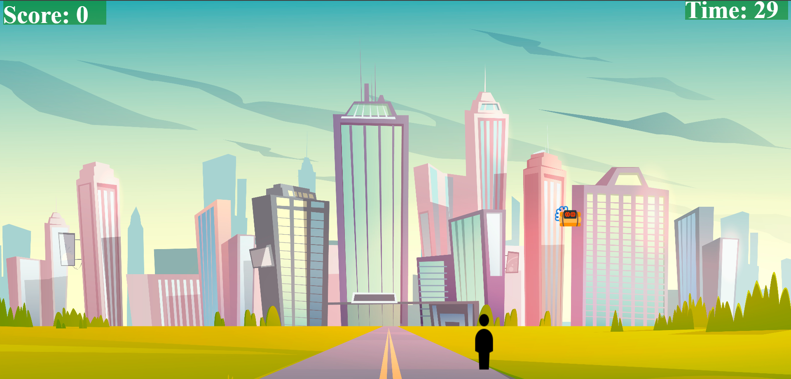

# FEWD-CA2

You Can Play the Game Here : https://shreyas2004wagh.github.io/CA2_FEWD_/

# Game Idea : 
Catch the bombs to save the city.

# How To Play : 
1. You have to catch the bombs by moving the mouse for website view and for the mobile view we can use the touch. 
2. You have to catch bombs by using mouse on them.

# Brief Idea of Working of the Game : 
Use your mouse or touch gestures to maneuver the character within the game container. As the timer counts down, bombs fall from the top, 
and your goal is to catch them for points while avoiding penalties for missed bombs. The difficulty increases based on your chosen level, offering a dynamic gaming experience. 

# Special Features in the Game : 
1. There are Sound Effects while playing the game.
2. The Game is Mobile Responsive for Max-Width : 600px.
3. Different Phrases are being used on the Results Page.

# Tech Stack Used : HTML, CSS, JAVASCRIPT, FIGMA.

# Screens in the Game : 
1. First Page of the Game : 

2. Instructions Page : 

3. Main Game Page : 

4. Results Page : 

# References :
1. Icons8
For icons.

2. I have Used Google to get background Image for my Game. 

3. https://www.figma.com/file/BsmhKx8CLMKPKkLJaOAL3c/Create-an-User-Journey-Map?type=design&node-id=6%3A5&mode=design&t=7IJoz2lMJRdCi34q-1
I have used figma to create designs of my game screens. 
Resources:
https://github.com/melissapnyc/catch/blob/master/script.js

4.ALL MUSIC from google royalty free music and sound effects
